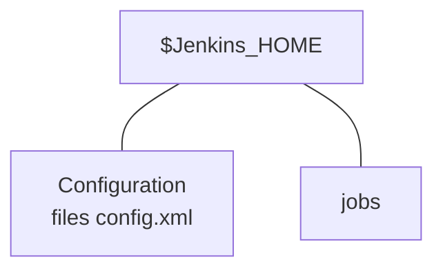

1. Backup 
2. Restore
3. Monitor
4. Scale
5. Manage
## Backup and Restore



#### BACKUP PLUGIN
***Manage Jenkins -> Manage Plugins ->(available=Backup) ThinBackup -> Install without restart***
then
***Manage Jenkins -> Uncategorized -> ThinBackup (click) -> Backup Now***

> [!INFO]
> This will not work because we need a Backup Directory first.

> [!warning] attention
> In the newer version of ThinBackup plugin, the settings can be found under Manage Jenkins > System.

```bash
mkdir jenkinsbackup
cd jenkinsbackup
pwd (/home/mike/jenkinsbackup)
```
- Now we add out path in Backup Directory in the configuration:
/home/mike/jenkinsbackup (The dir exists, but is not writable)
```bash
chmod 777 .
cd ..
chmod 777 jenkinsbackup/ ->(slash= dir)
cd jenkinsbackup/

```
- In Jenkins web -> save 
If it is done correctly:
`ls (FULL-2025-01-03_19-52)`
#### Restore
In Jenkins 
- Settings, check all options availables sauf Backup additional files ->Save
ThinBackup -> Backup Now 
to confirm: `~/jenkinsbackup$ ls`  we have .zips and files of our backups
ThinBackup -> Backup Now -> Restore (choose one and restore)

## LAB
***Under which location Jenkins store its data primarily?***
- $JENKINS_HOME variable holds the value of Jenkins home directory, which is /var/lib/jenkins in most of the cases but nor necessarily. This is where Jenkins stores its data like jobs, plugins, configs etc
***Which of the following is the main configuration file of Jenkins?***
- config.xml is the main configuration file of the Jenkins server.
***While backing up Jenkins server, which of the following directories is the most crucial to backup?***
- Jenkins home directory is most important to backup, since it contains all jobs, configuration, build history, plugins etc.
***Install the ThinBackup Jenkins plugin.***
1. Go to Manage Jenkins.
2. Click on Plugins.
3. Under Available, search for ThinBackup plugin.
4. Select and install it.
5. After that click on Restart Jenkins when installation is complete and no jobs are running.
***Backup Jenkins (including plugins) under /var/lib/jenkins/jenkins_backup directory using thinBackup plugin.***
- sudo mkdir /var/lib/jenkins/jenkins_backup
- sudo chown -R jenkins /var/lib/jenkins/jenkins_backup
Login into the Jenkins and follow the below given steps:
1. Go to Manage Jenkins.
2. Click on ThinBackup.
3. Go to Settings and enter ***/var/lib/jenkins/jenkins_backup*** as the Backup directory, tick ***Backup plugins archives*** check box and save the changes.
NOTE: In the newer version of ThinBackup plugin, the settings can be found under Manage Jenkins > System.
4. Click on Backup Now.
```js
root@jenkins-server lib/jenkins/jenkins_backup ➜  ls
FULL-2025-01-10_14-23

root@jenkins-server lib/jenkins/jenkins_backup ➜  
```
***Using ThinBackup plugin, restore the Jenkins backup (including plugins) you just took in the previous question.
Make sure to restart the Jenkins service after restoring the backup. `service jenkins restart`***
1. Go to Manage Jenkins.
2. Click on ThinBackup.
3. Click on Restore.
4. Select the latest backup available from the list, select Restore plugins and then click Restore (you need not to select any other options).
5. Restart Jenkins service.
 `service jenkins restart`
```js
 root@jenkins-server lib/jenkins/jenkins_backup ➜  service jenkins restart
 * Restarting Jenkins Automation Server jenkins                                                                                    Setting up max open files limit to 8192
                                                                                                                            [ OK ]

```
