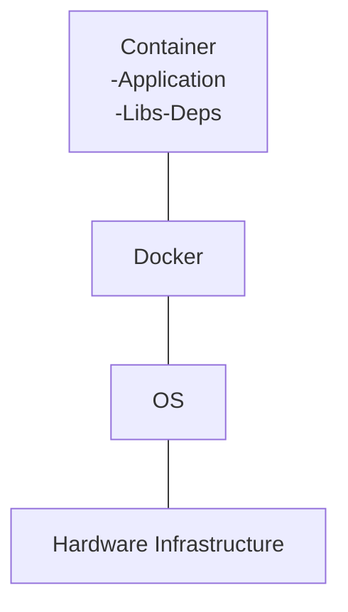
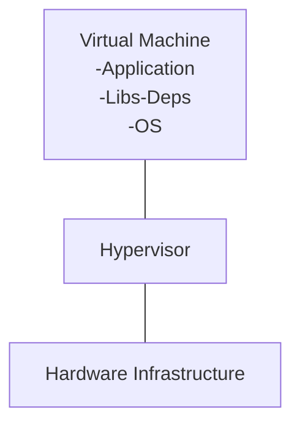

***Why do you need Docker?***
- Web Server -> Nodejs express
- Database -> mongoDB
- Messaging -> Reddis
- Orchestration -> Ansible

***What are containers?***
- Containers are completely isolated environments, as in they can have their own processes or services, network interfaces, their own mounts, just like VM, except they all share the same OS kernel.

The main purpose of Docker is to package and containerized applications and to ship them and to run them anywhere any time as many times as you want.
### Containers Vs Virtual Machines
#### Containers



```groovy
+-----------------------------------+
|            Containers             |
|           (Application)           |
|    (bibliotecas y dependencias)   |
+-----------------------------------+
                |
                v
+-----------------------------------+
|          Docker Engine            |
|      (Docker Daemon y CLI)        |
+-----------------------------------+
                |
                v
+-----------------------------------+
|      OS (Sistema Operativo)        |
|        (Linux o Windows)           |
+-----------------------------------+
                |
                v
+-----------------------------------+
|     Hardware Infrastructure       |
|  (Máquinas físicas o virtuales)   |
+-----------------------------------+

```
#### Virtual Machines



```groovy
+-----------------------------------+
|          VIRTUAL MACHINE          |
|           (Application)           |
|    (bibliotecas y dependencias)   |
|        (Operating Systems)        |
+-----------------------------------+
                |
                v
+-----------------------------------+
|            HYPERVISOR             |
+-----------------------------------+
                |
                v
+-----------------------------------+
|     HARDWARE INFRASTRUCTURE       |
|  (Máquinas físicas o virtuales)   |
+-----------------------------------+
```

## Containers & Virtual Machines
```groovy
+-----------------------------------+
|          VIRTUAL MACHINE          |
|             CONTAINERS            |
|           (Application)           |
|    (bibliotecas y dependencias)   |
|        (Operating Systems)        |
+-----------------------------------+
                |
                v
+-----------------------------------+
|            HYPERVISOR             |
+-----------------------------------+
                |
                v
+-----------------------------------+
|     HARDWARE INFRASTRUCTURE       |
|  (Máquinas físicas o virtuales)   |
+-----------------------------------+
```

```groovy
+-----------------------------------+
|          VIRTUAL MACHINE          |
|  +-----------------------------+  |
|  |          CONTAINERS         |  |
|  |   +---------------------+   |  |
|  |   |    Application      |   |  |
|  |   +---------------------+   |  |
|  |   +---------------------+   |  |
|  |   |   Libs & Deps       |   |  |
|  |   +---------------------+   |  |
|  |   +---------------------+   |  |
|  |   | Operating Systems   |   |  |
|  |   +---------------------+   |  |
|  +-----------------------------+  |
+-----------------------------------+

```

```JS
				  VIRTUAL MACHINE   
+----------------------------------------------------+
|          CONTAINER             CONTAINER           |
|  +--------------------+    +--------------------+  |
|  |    +-----------+   |    |   +-----------+    |  |
|  |    |Application|   |    |   |Application|    |  |
|  |    +-----------+   |    |   +-----------+    |  |
|  |    +-----------+   |    |   +-----------+    |  |
|  |    |   Libs    |   |    |   |   Libs    |    |  |
|  |    +-----------+   |    |   +-----------+    |  |
|  |    +-----------+   |    |   +-----------+    |  |
|  |    |   Deps    |   |    |   |   Deps    |    |  |
|  |    +-----------+   |    |   +-----------+    |  |
|  +--------------------+    +--------------------+  |
|  +----------------------------------------------+  |
|  |                    DOCKER                    |  |
|  +----------------------------------------------+  |
|  +----------------------------------------------+  |
|  |                      OS                      |  |
|  +----------------------------------------------+  |
+----------------------------------------------------+
+----------------------------------------------------+
|                    HYPERVISOR                      |
+----------------------------------------------------+
+----------------------------------------------------+
|              HARDWARE INFRASTRUCTURE               |
+----------------------------------------------------+

```
## Container Vs Image
#### Image
Is a package or a template, it is used to create one or more containers.
#### Containers
Are running instances of images that are isolated and have their own environments and set of processes.

## Setup and Install Docker
go to docs.docker.com -> get docker
1. Check out the prerequisites
2. uninstall old version's docker
3. At the bottom of the <docs.docker.com> there is a script
	1. curl ...sh
	2. ...sh

> [!failure]
> IT CHANGES EVERYTIME, SO WE NEED TO VERIFY THE DOCS

**When it is finally done.**
`sudo docker run docker/whalesay cowsay Hello-World!`


