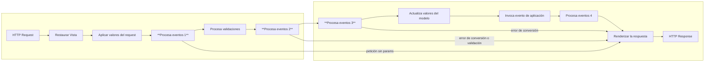

CAPA WEB MVC: ==JSF==(Presentación), 
				==Controller==(Bean CDI), 
				==Model==(POJO o Entity)
CONTENEDOR EJB: ==Capa Servici==o(EJB Servicios), 
				==Capa Datos==(Repositorios JPA, JDBC)
#### Ciclo de vida
http request -> restaura la vista -> aplica valores del request -> **procesa eventos** -> procesa las validaciones -> **procesa eventos** -> actualiza valores del modelo -> **procesa eventos** -> invoca evento de aplicación -> procesa eventos -> renderizar la respuesta -> http response

quiero que el primer procesa eventos tenga otra flecha hacia renderizar la respuesta y que la flecha diga petición sin params.
Que en el segundo procesa eventos tenga otra flecha que vaya hacia renderizar la respuesta y la flecha que diga error de conversión o validación.
que el tercer procesa eventos vaya hacia renderizar la respuesta y la flecha que diga error de conversión.



> [!tip] Create Live template
> 1. copiar la parte del pom que será muy usado en otros proyectos.
> 2. alt+ctrl+s ->editor ->live template -> maven -> + -> live template -> abbreviation(nombrar) -> pegar en template text -> define maven ->apply

Ver la doc de jakartaee ara conseguir el web.xml ->html -> punto 14.4.1. A Basic Example. 
```java
xmlns="https://jakarta.ee/xml/ns/jakartaee"
         xmlns:xsi="http://www.w3.org/2001/XMLSchema-instance"
         xsi:schemaLocation="https://jakarta.ee/xml/ns/jakartaee https://jakarta.ee/xml/ns/jakartaee/web-app_5_0.xsd"
         version="5.0">
 //se ha copiado mal, la solución es duplicar el link concatenando el web-app_5_0.xsd
 //y añadir esta dep en el pom para eliminar errores de DTD
 <dependency>
    <groupId>jakarta.servlet</groupId>
    <artifactId>jakarta.servlet-api</artifactId>
    <version>6.1.0</version>
    <scope>provided</scope>
</dependency>
```

> [!warning] Attention!
> Para plantillas de jsf3 siempre usar XHTML

@Named y @RequestScoped = @Model. Si usamos esas dos, usamos solo @Model

> [!success] documentación Jakartaee 9
> - 8.3. persistence.xml Schema
> -  web.xml - 14.4.1. A Basic Example
> - bean.xml5.1.1.2. Declaring selected alternatives for a bean archive.
> - context.xml Jakarta Contexts and Dependency Injection
> - jakarta servlet

#### Sección 70 - formulario y validación
> [!tip] CRUD (CrudRepo)
```java
public interface CrudRepository <T>{
    List<T> findAll();
    T findById(Long id);
    void save(T t);
    void delete(Long id);
}
```


> [!tip] CRUD (ProductRepositoryImpl)
```java

@RequestScoped
public class ProductRepositoryImpl implements CrudRepository<Product> {

	@Inject
    private EntityManager em;
    
	@Override
    public List<Product> findAll() {
        return em.createQuery("FROM Product", Product.class).getResultList();
    }

    @Override
    public Product findById(Long id) {
        return em.find(Product.class, id);
    }

    @Override
    public void save(Product product) {

    }

    @Override
    public void delete(Long id) {

    }
}
```


> [!warning] Service (ProductService)
```java
@Local
public interface ProductService {
    List<Product> findAll();
    Optional<Product> findById(Long id);
    void save(Product product);
    void delete(Long id);
}
```


> [!warning] Service (ProductServiceImpl)
```java
@Stateless
public class ProductServiceImpl implements ProductService{

    @Inject
    private CrudRepository<Product> repository;

    @Override
    public List<Product> findAll() {
        return repository.findAll();
    }

    @Override
    public Optional<Product> findById(Long id) {
        return Optional.ofNullable(repository.findById(id));
    }
    
    @Override
    public void save(Product product) {
        repository.save(product);
    }

    @Override
    public void delete(Long id) {
        repository.delete(id);
    }
}
```
#### Clase Converter para lista select
1. `CategoryConverter implements Converter<Category>` @Model
2. Injectamos el service
3. override getAsObject getAsString
#### Validación usando anotaciones
@NotEmpty : se usa para los atributos de String o cadenas de texto
@NotNull : se usa para objetos y números
(message = "mensaje personalizado"): añadido al lado de las anotaciones.

### Sección 71- JSF3- Estilos CSS y Templates
1. Descargamos el css y el bundle de bootstrap:
https://cdn.jsdelivr.net/npm/bootstrap@5.3.8/dist/css/bootstrap.min.css
https://cdn.jsdelivr.net/npm/bootstrap@5.3.8/dist/js/bootstrap.bundle.min.js
2. Pegamos en la url, guardar como, y guardar dentro de la carpeta de nuestro proyecto JavaEE que contiene todos los demás proyectos.
3. Todo lo que sea imagen, estilos, javascript debe estar dentro de webapp -> creamos un dir 'resources' (no resources del main).
4. creamos 3 dir: img, css, js.
5. Copiamos la img dentro de la carpeta img y `<h:graphicImage value="/resources/img/frieren3.jpg" alt="frieren"/>`
6. En algunas partes se remplaza h por ui
7. ui:composition engloba todo y añadimos atributos xmlns:ui y template:
	`xmlns:ui="http://xmlns.jcp.org/jsf/facelets"` - 
	`template="/WEB-INF/layouts/main.xhtml">`
8. `<ui:insert name="head">
9. `<ui:define name="content">
10. `<h:outputStylesheet name="css/bootstrap.min.css" />` 
11. `<h:outputScript name="css/bootstrap.bundle.min.css" />`

##### Mensajes Flash
Duran un solo request, y solo se usan en el redirect
1. definimos el bean ProducerResources, anotado con @AppScoped
2. cada mensaje con @RequestScoped (método devuelve FacesContext)
3. en main.xml, antes del content y después del container, añadir el tag messages con sus banderas y estilos.
4. Injectamos el FacesContexte en controlador, en el metodo save preguntamos si id= null o mayor a 0, lanzamos mensaje que se ha actualizado con éxito sino creamos uno nuevo. ` facesContext.addMessage(null, new FacesMessage("Product " + product.getName() + " successfully updated!"));`

- 📅 Date : 2025-10-02
- 💬 Commit description : Flash messages
- 🔗 Commit : [{{commit_hash}}](https://github.com/CrHacker7/javaMaster/commit/{{06c6a0d5fe652b4d1bd1a2f58550cc326e6291ba}})

